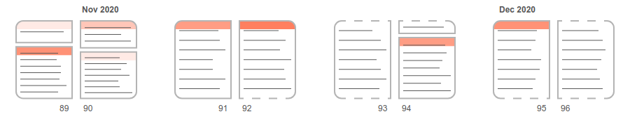

# One way to visualize a personal diary.

## About the project

I thought it would be interesting to try to represent the **structure of the pages of my latest diary**, using simple design choices.



The rules are:

* each <strong>block</strong> inside a page represents a single <strong>writing session</strong>, made on a certain date
* the <strong>height</strong> of each block is proportional to the actual space that it occupies on the original page
* if a writing session spans over <strong>multiple pages</strong>, the upper and/or lower side of its related block will be a <strong>dashed line</strong>, to express continuation
* if I skipped writing for one or more days, at the top of the block you will see a <strong><span style="color: #ff8c6b">orangish</span> colored header</strong>; the darker the shade, the more days were skipped
* if that session spans over multiple pages, the blocks on the following pages will have a unique <strong><span style="color: #548fff">bluish</span> colored header</strong>

## Links

[Online version](https://pitou.it/diary)

## Development

Just install the dependencies and launch the project:

```
yarn
yarn start
```

## Todo

* Implement an alternative view in which the **number of rows** in a block is taken in consideration instead of its height
* Rewrite code using Typescript
* Write tests
