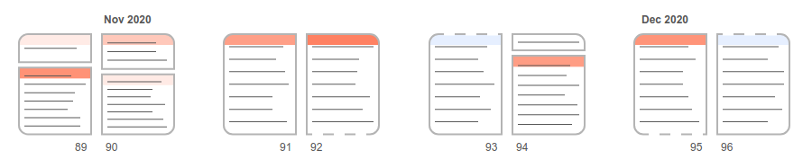

# One way to visualize a personal diary.

### Quick start

Just install the dependencies and launch the project:

```
yarn
yarn start
```

## About the project

I thought it would be interesting to try to represent the **structure of my latest diary pages**, using simple design choices.

The rules are:

<ul>
  <li>each <strong>block</strong> inside a page represents a single <strong>writing session</strong>, on a certain date</li>
  <li>the <strong>height</strong> of each block is proportional to the actual space that it occupies on the original page</li>
  <li>if a writing session spans over <strong>multiple pages</strong>, the upper and/or lower side of its related block will be a <strong>dashed line</strong>, to express continuation</li>
  <li>if I skipped writing for one or more days, at the top of the block you will see a <strong>colored header</strong>; the darker the color, the more days were skipped</li>
</ul>

Some examples:



## Todo

* Implement an alternative view in which the **number of rows** in a block is taken in consideration instead of its height
* Rewrite code using Typescript

